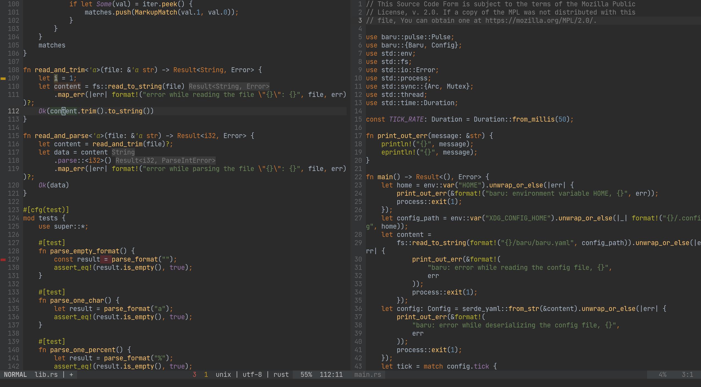

## Darcula



:smiling_imp: A [Vim](https://www.vim.org/)/[Neovim](https://neovim.io/) color scheme reproduction of the official [JetBrains](https://www.jetbrains.com/) IDE Darcula theme

### install
If you use a plugin manager, follow the traditional way.

For example with [vim-plug](https://github.com/junegunn/vim-plug) add this in `.vimrc`/`init.vim`:
```
Plug 'doums/darcula'
```

Then run in vim:
```
:source $MYVIMRC
:PlugInstall
```
If you use vim package `:h packages`.

### usage
Put this in your `.vimrc`/`init.vim`:
```
colorscheme darcula
```
To fully enjoy the color scheme and if your terminal supports [Truecolor](https://gist.github.com/XVilka/8346728) add
```
set termguicolors
```

If you use [lightline](https://github.com/itchyny/lightline.vim):
```
let g:lightline = { 'colorscheme': 'darculaOriginal' }
```
NOTE: lightline already provides a "darcula" color scheme that I find simply bad. I strongly recommend to use mine instead (using `darculaOriginal` instead of `darcula` in the above config).

### VimScript API

#### darcula#palette
the colors palette of Darcula

#### darcula#Hi
helper function to create/modify highlight group

#### example:
```
call darcula#Hi('rustLifetime', darcula#palette.macroName, darcula#palette.bg, 'italic')
call darcula#Hi('Comment', [ '#eeeeee', 255 ], darcula#palette.null, 'italic')
call darcula#Hi('BlackFg', [ '#000000', 16 ])
```

### helper groups
Darcula provides some helper groups.\
You can use them with `hi link`.

[GitGutter](https://github.com/airblade/vim-gitgutter)
```
hi! link GitGutterAdd GitAddStripe
hi! link GitGutterChange GitChangeStripe
hi! link GitGutterDelete GitDeleteStripe
let g:gitgutter_sign_removed = '▶'
```

[Coc](https://github.com/neoclide/coc.nvim)
```
hi! link CocErrorSign ErrorSign
hi! link CocWarningSign WarningSign
hi! link CocInfoSign InfoSign
hi! link CocHintSign InfoSign
hi! link CocErrorFloat Pmenu
hi! link CocWarningFloat Pmenu
hi! link CocInfoFloat Pmenu
hi! link CocHintFloat Pmenu
hi! link CocHighlightText IdentifierUnderCaret
hi! link CocHighlightRead IdentifierUnderCaret
hi! link CocHighlightWrite IdentifierUnderCaretWrite
hi! link CocErrorHighlight CodeError
hi! link CocWarningHighlight CodeWarning
hi! link CocInfoHighlight CodeInfo
hi! link CocHintHighlight CodeHint
```

[ALE](https://github.com/dense-analysis/ale)
```
hi! link ALEError Error
hi! link ALEWarning CodeWarning
hi! link ALEInfo CodeInfo
hi! link ALEErrorSign ErrorSign
hi! link ALEWarningSign WarningSign
hi! link ALEInfoSign InfoSign
```

### color support
- Truecolor
- 256 color

### credits
[JetBrains](https://www.jetbrains.com/) for the original and awsome Darcula color scheme!

### license
Mozilla Public License 2.0
